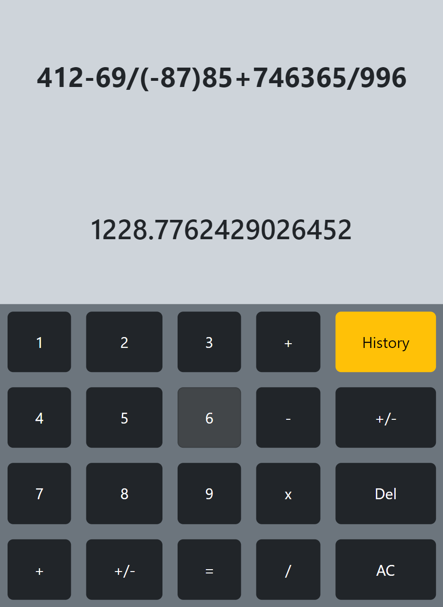
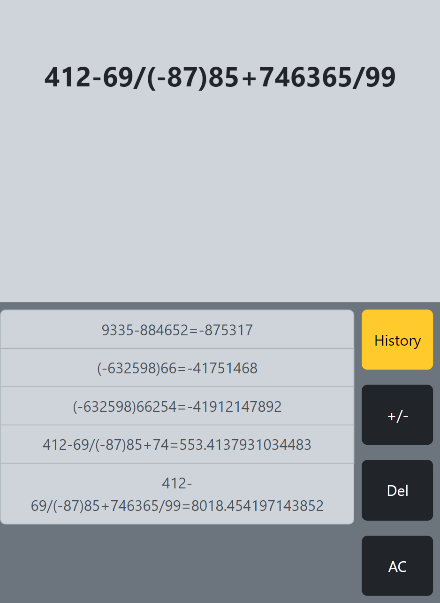

# SIMPLE CALCULATOR USING REACT

### Actions that can be performmed
* Addition(+)
* Subraction(-)
* Multiplication(*)
* Division(/)
* Plus or Minus(+/-)
* Point(.)
* Delete(Del)
* All Clear(AC)
* History

### SCREENSHOTS

